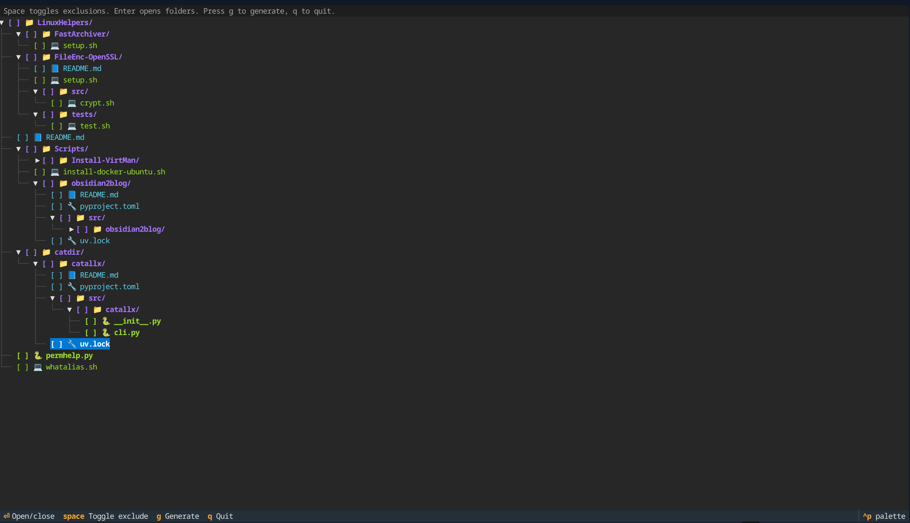

# catallx

`catallx` walks a directory, filters files by extension or path rules, and emits a
copy-friendly bundle of the directory tree plus file contents.

Output formats:
- Markdown (default)
- XML

Optional tree view uses ANSI colors grouped by file families so related extensions are easy to scan.



---

## Table of Contents

- [Features](#features)
- [Installation](#installation)
- [Basic Usage](#basic-usage)
- [Filtering](#filtering)
- [Interactive Mode](#interactive-mode)
- [Output Notes](#output-notes)
- [Examples](#examples)
- [Example Output](#example-output)

---

## Features

- Markdown or XML output for:
  - editors
  - LLM prompts
  - documentation
  - audits
- Colored directory trees with extension grouping
- Extension-aware filtering
- Default ignore list:
  - `.git`, `node_modules`, `__pycache__`, `.venv`, `dist`, `build`
- Interactive file exclusion (Textual UI)
- Clipboard support:
  - `xclip`
  - `wl-copy`
  - `pbcopy`

---

## Installation

### Using `uv`

```bash
uv tool install .
````

Verify installation:

```bash
catallx --help
```

### Development Mode

```bash
uv sync
uv run catallx --help
```

Force reinstall after changes:

```bash
uv tool install --force .
```

---

## Basic Usage

Show help:

```bash
catallx --help
```

Dump directory as Markdown:

```bash
catallx /path/to/project
```

Include tree:

```bash
catallx /path/to/project --tree
```

Output XML:

```bash
catallx /path/to/project --format xml
```

Disable color:

```bash
catallx /path/to/project --tree --no-color
```

Copy output to clipboard:

```bash
catallx /path/to/project --tree --cl
```

---

## Filtering

Exclude specific files/extensions:

```bash
catallx . --exclude pyc,package-lock.json,generated/*
```

Exclude directories globally:

```bash
catallx . --exclude-dirs env,coverage,tmp
```

Include only selected types:

```bash
catallx . --only py,md,toml
catallx . --only "*.py,src/**/*.md"
```

Disable default blacklist:

```bash
catallx . --no-default-blacklist
```

---

## Interactive Mode

Launch selector:

```bash
catallx . --interactive
# or
catallx . -i
```

### Controls

* `↑ / ↓` → Navigate
* `Enter` → Expand/collapse folder
* `Space` → Toggle exclusion
* `g` → Generate output
* `q` → Quit

Runs using a full-screen Textual UI.

---

## Output Notes

* Binary/image files (`png`, `jpg`, `pdf`, etc.) are listed but not embedded
* Non-UTF8 files are safely skipped
* Tree coloring:

  * Folders → Blue
  * Python → Green
  * JS/TS → Yellow/Blue
  * Web → Magenta
  * Config → Cyan
  * Shell → Green
  * Systems languages → Bright cyan

---

## Example Output

### Directory Structure

```bash
catallx . -i

# Directory Structure
├── 📘 README.md
└── 📁 Scripts
    ├── 📁 Install-VirtMan
    │   └── 💻 install-virtman.sh
    └── 💻 install-docker-ubuntu.sh
```

---

### File Contents (Markdown)
```
# File Contents (Markdown Format)

## README.md

```md
# LinuxHelpers
...
[SNIP]
```
## Examples

### Python-focused bundle

```bash
catallx . --tree --only py,toml,md --exclude-dirs .cache
```

### Config + docs only

```bash
catallx . --tree --only json,yaml,yml,toml,md
```

### XML export + clipboard

```bash
catallx . --format xml --cl
```

---

## Notes

* Running without arguments shows help
* Directory must exist (validated before execution)
* File paths are rejected (directory-only tool)

---

## License

MIT


---
